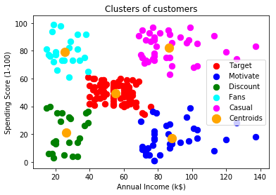

# Customer-Segmentation-using-K-Means-Clustering
In this Machine Learning project,we cluster mall customers into different categories based on their annual income,spending score,age,gender etc using Machine Learning's K-Means Clustering Model.

# Real Life use case
To identify different types of customers and assign each type a label.

# A Sample from our Dataset
CustomerID  ,Genre   ,Age   ,Annual Income (k$),   Spending Score (1-100)

0001,Male,19,15,39
0002,Male,21,15,81
0003,Female,20,16,6
0004,Female,23,16,77
0005,Female,31,17,40
0006,Female,22,17,76
...................
# Final Output

